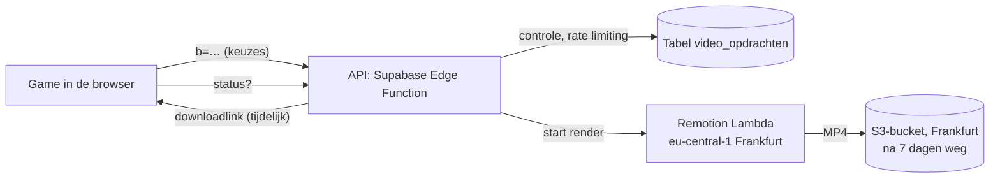

# Persoonlijke video: technisch ontwerp en kostenraming (fase 7)

Status: **niet gebouwd**. Besluit van 1 oktober 2026: geen video; de tegenbegroting blijft als Word, pdf
en afbeelding. Dit ontwerp blijft bewaard voor als de video later toch komt.

## 1. Wat het wordt

Na het indienen kan de speler op **Maak mijn video** drukken. Hij of zij krijgt dan een korte,
verticale video (9:16, 1080 × 1920, ongeveer 24 seconden) om te delen op Instagram, TikTok of in
WhatsApp. De video laat zien wat de speler met de begroting van de gemeente heeft gedaan.

### Storyboard

| Tijd      | Scène                | Wat je ziet                                                                                                                 |
| --------- | -------------------- | --------------------------------------------------------------------------------------------------------------------------- |
| 0 – 3 s   | Intro                | Videofragment van Rik (aan te leveren), met ondertitels.                                                                    |
| 3 – 8 s   | De gemeente          | De gemeentekaart van bovenaf. De gebouwen veranderen één voor één (dicht, versoberd, beter, bloeiend), zoals in de game.    |
| 8 – 17 s  | Drie grootste keuzes | Per keuze 3 seconden: het gebouw zoomt in, met de naam en het bedrag dat optelt ("Overhead −10%: + € 12,3 mln per jaar").   |
| 17 – 21 s | Saldo                | Het geldpotje met het slot, het saldo per jaar en de sterren.                                                               |
| 21 – 24 s | Outro                | Videofragment van Rik, daarna "Maak je eigen begroting" met de link (en een QR-code) en "Een initiatief van VVD Groningen". |

Alle tekst staat in beeld (ondertitels zijn ingebrand), zodat de video ook zonder geluid werkt. Er
zijn geen flitsende effecten. Muziek staat standaard uit; als die er wel komt, is een licentie
nodig voor rechtenvrije muziek.

### Wat erin staat, en wat niet

- **Alleen de keuzes van de speler.** De video wordt gemaakt uit dezelfde gegevens als de
  deellink (`?b=…`). De rekenmotor rekent de bedragen opnieuw uit; de browser stuurt dus geen
  bedragen mee.
- **De naam alleen als de speler die invult**, en alleen na het filter op scheldwoorden en
  persoonsgegevens (`src/inzending/filter.ts`), met een maximum van 40 tekens. _Advies: laat de naam
  in de video helemaal weg._ Een video met het logo van de fractie en een kwetsende "naam" is
  makkelijk te maken en te verspreiden. Zonder vrije tekst kan dat niet.
- Geen echte namen van andere mensen. Rik is de enige die in de video te zien is, in zijn eigen
  fragmenten.

## 2. Techniek

### Onderdelen

1. **`packages/video`**: een los pakket met Remotion (React). Het gebruikt de rekenmotor
   (`src/engine`) en de kaartgeometrie (`src/game/kaart/geometrie.ts`) van de game. De gebouwen
   worden opnieuw getekend als SVG, omdat de kaart in de game op een canvas wordt getekend. Zo blijven de
   bedragen en de kaart hetzelfde als in de game.
2. **Render op de server.** Twee mogelijkheden:
   - **A. Remotion Lambda** in de AWS-regio Frankfurt (eu-central-1). Geen eigen server. Schaalt
     vanzelf mee op drukke dagen. Betalen per video.
   - **B. Een eigen renderserver**: een Docker-container met Chromium en de Remotion-renderer op een
     VPS in de EU, met een wachtrij. Vaste prijs per maand, maar ook onderhoud. Op drukke momenten
     ontstaat een wachtrij.
3. **API**: een Supabase Edge Function. Supabase gebruiken we al voor de inzendingen.
   - `POST /video` met `{ b, naam? }`. De functie controleert de keuzes (`decodeer`), haalt de naam
     door het filter, past rate limiting toe en start de render. Antwoord: een id.
   - `GET /video/:id` geeft de voortgang, en als de video klaar is een tijdelijke downloadlink
     (7 dagen geldig).
   - De sleutels van AWS staan alleen in de Edge Function, nooit in de browser.
4. **In de game**: een knop op het eindscherm, een voortgangsbalk ("Je video wordt gemaakt… 40%"),
   daarna **Download** en **Delen** (Web Share API op de telefoon).

### Beveiliging, privacy en kosten in de hand

- **Rate limiting**: 3 video's per uur per (gehasht) adres, zoals bij het insturen. Een
  **dagplafond** (bijvoorbeeld 500 video's) en een **budgetalarm** in AWS, zodat de kosten nooit
  kunnen ontsporen.
- **Dezelfde keuzes geven dezelfde video**: die maken we maar één keer (cache op een hash van de
  keuzes). Dat scheelt geld als veel mensen een gedeelde link openen.
- **Bewaren**: video's en opdrachten worden na 7 dagen automatisch verwijderd. Geen IP-adressen in
  de database.
- **Verwerkersovereenkomst** met AWS (standaard in de AWS-voorwaarden) en de keuze voor de regio
  Frankfurt, zodat alles in de EU blijft.

### Testen

- In CI: `renderStill` maakt een paar losse beelden (een frame per scène) van een vaste
  testbegroting. Die beelden worden vergeleken met een referentie, zoals de screenshots van
  Playwright.
- Eén keer per release: een volledige render van de VVD-testcase. Ik kijk die zelf na.
- De API krijgt tests voor de controle, het filter en de rate limiting, net als `npm run db:test`.

## 3. Kostenraming

Bedragen zijn **schattingen**, in euro's (omgerekend van dollars, 1 dollar ≈ € 0,92), exclusief btw.
De echte kosten per video meten we met een proefrender (`estimatePrice()` van Remotion).

### Vaste kosten: de licentie van Remotion

Remotion is gratis voor particulieren, bedrijven met maximaal 3 medewerkers en organisaties zonder
winstoogmerk. Die laatste groep omschrijft Remotion als organisaties met een charitatief,
educatief, wetenschappelijk, artistiek of vergelijkbaar doel. **Een politieke fractie of partij
valt daar waarschijnlijk niet onder.** Dat kunnen we aan Remotion vragen.

Is er een licentie nodig, dan is het **Remotion for Automators**: $ 0,01 per video, met een minimum
van $ 100 per maand (ongeveer **€ 92 per maand**). Daarin zitten 10.000 video's per maand. De
licentie kan per maand, dus alleen tijdens de campagne.

### Kosten per video

|                                                             | Bij 1.000 video's | Bij 10.000 video's |
| ----------------------------------------------------------- | ----------------- | ------------------ |
| Rekentijd Lambda (ongeveer $ 0,01 per video van 24 s)       | € 9               | € 92               |
| Opslag en downloaden (video ongeveer 8 MB, 7 dagen bewaren) | € 1               | € 7                |
| Supabase (bestaand project; gratis of Pro $ 25 per maand)   | € 0 tot € 23      | € 0 tot € 23       |

### Totaal voor een campagne van 3 maanden

Zonder Supabase (dat project is er al voor de inzendingen).

| Scenario                                                 | Licentie (3 × € 92) | Render en opslag | Totaal                       |
| -------------------------------------------------------- | ------------------- | ---------------- | ---------------------------- |
| A. Lambda, 1.000 video's                                 | € 276               | € 10             | **ongeveer € 290**           |
| A. Lambda, 10.000 video's                                | € 276               | € 99             | **ongeveer € 375**           |
| B. Eigen server (VPS ongeveer € 15 tot € 30 per maand)   | € 276               | € 45 tot € 90    | **ongeveer € 320 tot € 370** |
| Licentie niet nodig (non-profit), Lambda, 10.000 video's | € 0                 | € 99             | **ongeveer € 100**           |

De licentie is dus de grootste post. Lambda en een eigen server ontlopen elkaar weinig. Lambda vraagt
geen onderhoud en vangt drukke dagen op; een eigen server geeft op zo'n dag een wachtrij.

### Werk

Ongeveer 8 tot 10 werkdagen voor één ontwikkelaar: de video zelf (3 à 4 dagen), de render en de API
(2 à 3), de knop en de voortgang in de game (1), tests en toegankelijkheid (1), en AWS en hosting
inrichten (1).

## 4. Alternatief zonder server (niet volgens de opdracht)

De game kan een eenvoudigere video ook **in de browser** opnemen (canvas en MediaRecorder). Dat kost
niets per video, er gaat niets naar een server en er is geen licentie nodig. Nadelen: het werkt niet
in elke browser even goed (Safari maakt MP4, Chrome WebM), oude telefoons zijn traag, en de video ziet
er minder strak uit. De opdracht vraagt om Remotion en renderen op de server. Daarom is dit alleen
een terugvaloptie.

## 5. Advies

**Optie A: Remotion Lambda in Frankfurt**, aangestuurd door een Supabase Edge Function. Zonder naam
in de video, met een dagplafond en een budgetalarm. Eerst een proefrender om de kosten per video te
meten. Daarna de licentie alleen afsluiten voor de maanden van de campagne.

## 6. Wat ik nodig heb om te bouwen

1. **Akkoord op optie A** (of een voorkeur voor B).
2. **De licentie**: vraagt de fractie Remotion of de gratis licentie geldt, of is er budget voor
   ongeveer € 92 per maand tijdens de campagne?
3. **Twee videofragmenten van Rik**: een intro en een outro van elk maximaal 3 seconden, verticaal
   (1080 × 1920), met de tekst die hij zegt (voor de ondertitels).
4. **De naam in de video**: weglaten (advies) of tonen na het filter?
5. **Een AWS-account** op naam van de fractie, met een creditcard of factuur, voor Lambda en S3. Wie
   beheert dat?
6. **Een schatting** van het aantal spelers en de periode van de campagne, voor het dagplafond.
